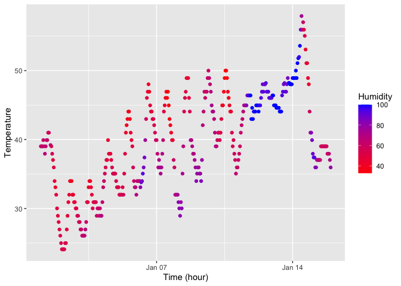

Homework 1
================
Yuqing Liu
2023-09-14

# Problem 1

Load the moderndive library, and use the following code to load the
early_january_weather dataset.

``` r
library(moderndive)
data("early_january_weather")
```

Write a short description of the dataset using inline R code. To do
this, I used the str() function to see the structure of the dataset.

``` r
str(early_january_weather)
```

    ## tibble [358 × 15] (S3: tbl_df/tbl/data.frame)
    ##  $ origin    : chr [1:358] "EWR" "EWR" "EWR" "EWR" ...
    ##  $ year      : int [1:358] 2013 2013 2013 2013 2013 2013 2013 2013 2013 2013 ...
    ##  $ month     : int [1:358] 1 1 1 1 1 1 1 1 1 1 ...
    ##  $ day       : int [1:358] 1 1 1 1 1 1 1 1 1 1 ...
    ##  $ hour      : int [1:358] 1 2 3 4 5 6 7 8 9 10 ...
    ##  $ temp      : num [1:358] 39 39 39 39.9 39 ...
    ##  $ dewp      : num [1:358] 26.1 27 28 28 28 ...
    ##  $ humid     : num [1:358] 59.4 61.6 64.4 62.2 64.4 ...
    ##  $ wind_dir  : num [1:358] 270 250 240 250 260 240 240 250 260 260 ...
    ##  $ wind_speed: num [1:358] 10.36 8.06 11.51 12.66 12.66 ...
    ##  $ wind_gust : num [1:358] NA NA NA NA NA NA NA NA NA NA ...
    ##  $ precip    : num [1:358] 0 0 0 0 0 0 0 0 0 0 ...
    ##  $ pressure  : num [1:358] 1012 1012 1012 1012 1012 ...
    ##  $ visib     : num [1:358] 10 10 10 10 10 10 10 10 10 10 ...
    ##  $ time_hour : POSIXct[1:358], format: "2013-01-01 01:00:00" "2013-01-01 02:00:00" ...

``` r
summary(early_january_weather)
```

    ##     origin               year          month        day              hour      
    ##  Length:358         Min.   :2013   Min.   :1   Min.   : 1.000   Min.   : 0.00  
    ##  Class :character   1st Qu.:2013   1st Qu.:1   1st Qu.: 4.000   1st Qu.: 6.00  
    ##  Mode  :character   Median :2013   Median :1   Median : 8.000   Median :11.50  
    ##                     Mean   :2013   Mean   :1   Mean   : 8.039   Mean   :11.53  
    ##                     3rd Qu.:2013   3rd Qu.:1   3rd Qu.:12.000   3rd Qu.:17.75  
    ##                     Max.   :2013   Max.   :1   Max.   :15.000   Max.   :23.00  
    ##                                                                                
    ##       temp            dewp           humid           wind_dir    
    ##  Min.   :24.08   Min.   : 8.96   Min.   : 32.86   Min.   :  0.0  
    ##  1st Qu.:33.98   1st Qu.:19.94   1st Qu.: 51.34   1st Qu.:140.0  
    ##  Median :39.02   Median :26.06   Median : 61.67   Median :240.0  
    ##  Mean   :39.58   Mean   :28.06   Mean   : 65.48   Mean   :208.2  
    ##  3rd Qu.:44.96   3rd Qu.:35.06   3rd Qu.: 78.68   3rd Qu.:290.0  
    ##  Max.   :57.92   Max.   :53.06   Max.   :100.00   Max.   :360.0  
    ##                                                   NA's   :5      
    ##    wind_speed       wind_gust         precip            pressure   
    ##  Min.   : 0.000   Min.   :16.11   Min.   :0.000000   Min.   :1011  
    ##  1st Qu.: 5.754   1st Qu.:19.56   1st Qu.:0.000000   1st Qu.:1018  
    ##  Median : 8.055   Median :21.86   Median :0.000000   Median :1022  
    ##  Mean   : 8.226   Mean   :22.53   Mean   :0.002039   Mean   :1023  
    ##  3rd Qu.:11.508   3rd Qu.:25.32   3rd Qu.:0.000000   3rd Qu.:1027  
    ##  Max.   :24.166   Max.   :31.07   Max.   :0.190000   Max.   :1034  
    ##                   NA's   :308                        NA's   :38    
    ##      visib          time_hour                     
    ##  Min.   : 0.120   Min.   :2013-01-01 01:00:00.00  
    ##  1st Qu.: 9.000   1st Qu.:2013-01-04 19:15:00.00  
    ##  Median :10.000   Median :2013-01-08 12:30:00.00  
    ##  Mean   : 8.515   Mean   :2013-01-08 12:28:09.39  
    ##  3rd Qu.:10.000   3rd Qu.:2013-01-12 05:45:00.00  
    ##  Max.   :10.000   Max.   :2013-01-15 23:00:00.00  
    ## 

We can find the number of rows (observations) and columns (variables) in
the dataset using the nrow() and ncol().

``` r
nrow(early_january_weather)
```

    ## [1] 358

``` r
ncol(early_january_weather)
```

    ## [1] 15

We can find the mean temperature using the mean().

``` r
mean(early_january_weather$temp)
```

    ## [1] 39.58212

Discussion: The important variable in this dataset is temp
(temperature). The value of temp ranges from 24.08 to 57.92. The dataset
has 358 rows and 15 columns. The mean temperature is 39.58.

Make a scatterplot of temp (y) vs time_hour (x); color points using the
humid variable (adding color = … inside of aes in your ggplot code
should help). Describe patterns that are apparent in this plot.

load the ggplot2 library:

``` r
library(ggplot2)
```

create scatterplot:

``` r
scatterplot <- ggplot(data = early_january_weather, aes(x = time_hour, y = temp, color = humid)) +
  geom_point() +
  labs(x = "Time (hour)", y = "Temperature", color = "Humidity") +
  scale_color_gradient(low = "blue", high = "red")
scatterplot
```

<!-- --> export
the scatterplot to the project directory using ggsave:

``` r
ggsave("scatterplot.png", plot = scatterplot, width = 8, height = 6, units = "in")
```

# Problem 2

Create a data frame comprised of:

a random sample of size 10 from a standard Normal distribution a logical
vector indicating whether elements of the sample are greater than 0 a
character vector of length 10 a factor vector of length 10, with 3
different factor “levels”

``` r
library(tidyverse)
```

    ## ── Attaching core tidyverse packages ──────────────────────── tidyverse 2.0.0 ──
    ## ✔ dplyr     1.1.3     ✔ readr     2.1.4
    ## ✔ forcats   1.0.0     ✔ stringr   1.5.0
    ## ✔ lubridate 1.9.2     ✔ tibble    3.2.1
    ## ✔ purrr     1.0.2     ✔ tidyr     1.3.0
    ## ── Conflicts ────────────────────────────────────────── tidyverse_conflicts() ──
    ## ✖ dplyr::filter() masks stats::filter()
    ## ✖ dplyr::lag()    masks stats::lag()
    ## ℹ Use the conflicted package (<http://conflicted.r-lib.org/>) to force all conflicts to become errors

``` r
problem2_df = tibble(
  norm_samp = rnorm(10),
  vec_logical = c(TRUE, TRUE, TRUE, FALSE, TRUE, TRUE, TRUE, FALSE, TRUE, FALSE),
  vec_char = c("This", "is", "an", "example", "data", "set", "from", "question", "number", "two"),
  vec_factor = factor(c("High School", "High School", "High School", "Bachelor's Degre", "Bachelor's Degre", "Bachelor's Degre", "Master's Degree", "Master's Degree", "Bachelor's Degre", "Master's Degree"),
                  levels = c("High School", "Bachelor's Degre", "Master's Degree"), labels = c(1, 2, 3))
)
```

Try to take the mean of each variable in your dataframe. What works and
what doesn’t?

``` r
mean(problem2_df$norm_samp)
```

    ## [1] -0.2089138

``` r
mean(problem2_df$vec_logical)
```

    ## [1] 0.7

``` r
mean(problem2_df$vec_char)
```

    ## Warning in mean.default(problem2_df$vec_char): argument is not numeric or
    ## logical: returning NA

    ## [1] NA

``` r
mean(problem2_df$vec_factor)
```

    ## Warning in mean.default(problem2_df$vec_factor): argument is not numeric or
    ## logical: returning NA

    ## [1] NA

The variable in the random sample (norm_samp) and the logical vector
(vec_logical) worked when taking the mean. However, the character vector
(vec_char) and factor vector (vec_factor) did not work. This is because
the variable in the random sample (norm_samp) is numeric (aka contain
numbers). Among the logical vector, TRUE is treated as the number 1, and
FALSE is treated as number 0. We can only do mean calcualtion for
variable that include numbers.

Write a code chunk that applies the as.numeric function to the logical,
character, and factor variables (please show this chunk but not the
output). What happens, and why? Does this help explain what happens when
you try to take the mean?

We create a new variable vec_char_num when writing as.numeric for the
character vector, and a new variable vec_fac_num for factor vector.

``` r
vec_char_num <- as.numeric(problem2_df$vec_char)
```

    ## Warning: NAs introduced by coercion

``` r
vec_char_num 
```

    ##  [1] NA NA NA NA NA NA NA NA NA NA

``` r
vec_fac_num <- as.numeric(problem2_df$vec_factor)
vec_fac_num
```

    ##  [1] 1 1 1 2 2 2 3 3 2 3

We take the mean again for the converted vectors.

``` r
mean(vec_char_num)
```

    ## [1] NA

``` r
mean(vec_fac_num)
```

    ## [1] 2

After writing the as.numeric, the factor vector (vec_factor) can work
when taking the mean. However, the character vector (vec_char) still do
not work.

This is becuase as.numeric function treated variables in the logical
vector (vec_logical) as numbers. Now, we can calculate the mean for the
converted logical vector (vec_fac_num) as it is now numeric. However,
the character vector cannot be converted to numeric. So, we still cannot
do mean calculation for the character variable.
